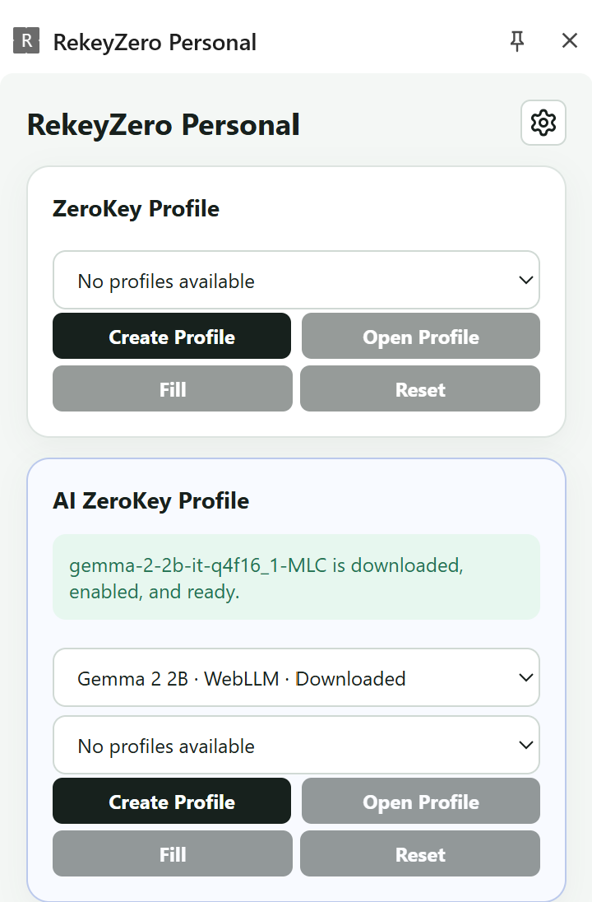
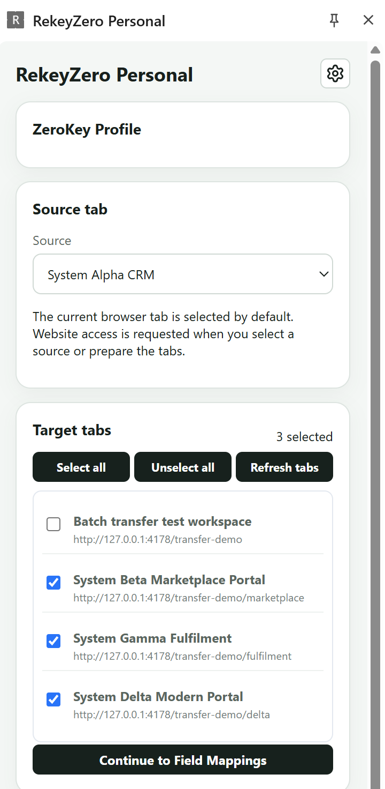
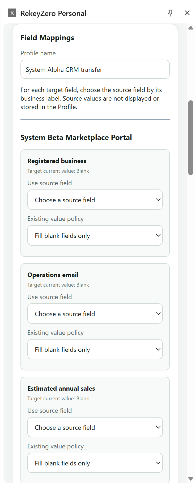
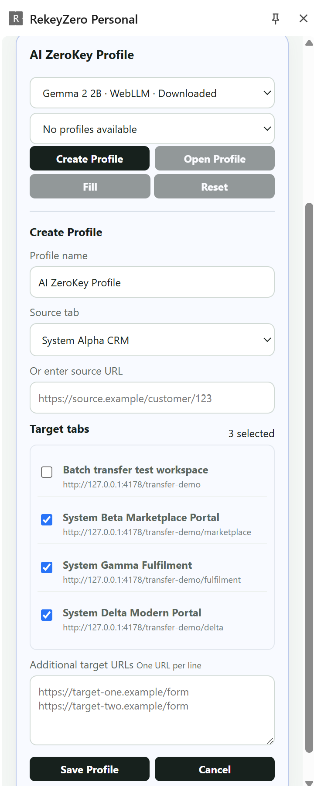
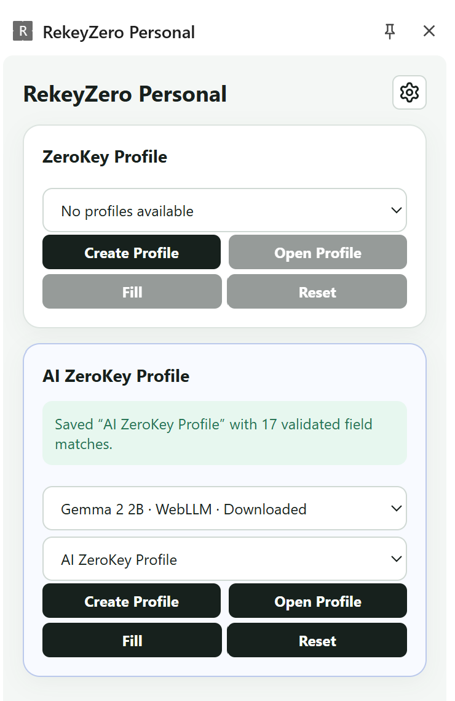

# RekeyZero

RekeyZero is a Personal Chromium extension for safely reusing information from one open web page across one or more target pages. The current product is extension-first: it stores Mapping Profiles locally, prepares guarded fill plans, writes supported form controls, and leaves final review and submission to the user.

This repository also contains a standalone web application source and synthetic browser-test pages. It does not include a RekeyZero backend, server-managed AI credentials, or a local-model service.

## Current product

The extension provides two profile workflows in its Side Panel.

### ZeroKey Profile

A ZeroKey Profile is created from one source tab and one or more target tabs. The user maps source fields to target fields and chooses how existing target values are handled:

- fill only when blank;
- allow overwrite; or
- never fill the field.

The saved profile contains page and field identities plus mapping policy. It does not contain current source-field values. **Fill** re-observes matching open pages, freezes the current source values for that batch, prepares the target actions, fills supported controls, and verifies the result. **Reset** clears the active batch without deleting the profile.

### AI ZeroKey Profile

An AI ZeroKey Profile uses AI to propose field relationships while retaining the same deterministic, guarded fill executor. AI matching receives field labels, control types, groups, and accepted options; it does not receive source-field values. Accepted mappings are saved as a reusable `ai_fill_setup` Mapping Profile.

The model selector currently supports:

- Qwen2.5 1.5B and Gemma 2 2B through browser-local WebLLM;
- Gemini through its direct API;
- DeepSeek through its direct API; and
- GPT through the OpenAI API, defaulting to `gpt-5.6-terra`.

All model options are selectable. Selecting an API model reveals only that provider's model and API-key inputs. Requests go directly from the extension to the selected provider; there is no RekeyZero proxy. API keys stay only in extension session storage and must be entered again after the browser restarts. **Reset** in API settings restores the provider's default model and clears its API key.

## Extension screenshots

Includes ZeroKey Profile (when you don't use AI) and AI ZeroKey Profile. Use either.

### Side Panel profiles



### Source and target tab selection



### Field mappings



### AI ZeroKey Profile editor



### Saved AI ZeroKey Profile



## ReKeyZero Admin

The Side Panel gear button opens the extension-owned Admin page. Its current sections are:

- **Profiles** — view, edit, and delete standard ZeroKey Profiles;
- **AI Setups** — view, edit, and delete AI ZeroKey Profiles;
- **Log** — inspect local AI requests, raw response attempts, parsed mappings, validation results, and runtime errors; and
- **Privacy** — export browser-local admin data or diagnostics and clear local RekeyZero data.

## Safety and privacy

RekeyZero is designed for user-supervised form filling:

- final submission remains manual;
- website and AI-provider host access is optional and requested when needed;
- password fields are excluded from observation, AI context, and fill;
- CAPTCHA and MFA are not bypassed;
- arbitrary model-generated JavaScript and selectors are never executed;
- stale or changed page state invalidates prepared actions;
- existing target values are preserved unless the profile explicitly permits overwrite;
- unsupported or ambiguous operations stop for user review; and
- API keys, information values, profile mappings, page text, and provider response bodies are excluded from diagnostics.

The extension keeps durable product state in browser IndexedDB. Active transfer batches and API keys use extension session storage.

## Requirements

- Node.js 22 or newer
- npm
- Chrome, Edge, or another compatible Chromium browser version 124 or newer
- WebGPU support when using a browser-local model

## Repository setup

From the repository root on Windows:

```powershell
.\setup.ps1
```

The setup script installs dependencies for the extension and web application, runs extension tests and checks, and checks the web application. No Python environment, FastAPI service, Ollama instance, or repository `.env` file is required for the Personal extension.

## Build and load the extension

```powershell
cd apps\extension
npm ci
npm run build
```

The stable unpacked build is written to `dist/rekeyzero-personal` at the repository root. In `chrome://extensions` or `edge://extensions`, enable Developer mode and load that directory with **Load unpacked**. Later builds overwrite the same directory; click **Reload** on the installed extension to pick up changes.

## Development and validation

From `apps/extension`:

```powershell
npm run check
npm test
npx playwright install chromium
npm run test:e2e
```

The manually triggered GitHub Actions workflow checks the web application, checks and tests the extension, runs the Chromium end-to-end suite, scans the release, and uploads the generated release candidates as a workflow artifact.

## Release package

Create a release candidate from a clean committed source state:

```powershell
cd apps\extension
npm run test:e2e
npm run release
```

The release command writes the following repository-level outputs:

```text
dist/rekeyzero-personal/
dist/rekeyzero-personal.zip
dist/rekeyzero-personal.manifest.json
```

The package process records source identity and file hashes, scans for secrets and remote-hosted executable references, and embeds `release-manifest.json` in the ZIP. Product changes require a new package and a new real-browser validation of that exact ZIP.

## Repository layout

```text
apps/extension/          Personal Chromium extension
apps/web/                Optional operator web UI; requires a compatible external API
tests/extension-portal/  Synthetic pages used by extension tests
.github/workflows/       Manually triggered CI and release-candidate workflow
```

The Personal extension and synthetic test pages do not depend on `apps/web`.

## Current limitations

RekeyZero is DOM-first and does not perform unattended navigation, final submission, post-submit business-response capture, visual Computer Use, or arbitrary model actions. Supported controls include common native inputs, textarea, select, checkbox, grouped radio controls, and explicitly adapted listbox/combobox widgets. Unadapted custom widgets, nested frames, Shadow DOM, PDFs, and canvas are not filled.

Real customer portals require acceptance testing for site-specific autosave, delayed validation, custom controls, and server-side persistence behavior.

## Project documentation

- [Extension details](apps/extension/README.md)
- [Web application](apps/web/README.md)
- [Contributing](CONTRIBUTING.md)
- [Security](SECURITY.md)
- [Support](SUPPORT.md)
- [Roadmap](ROADMAP.md)
- [Changelog](CHANGELOG.md)

## License

RekeyZero is licensed under the permissive [MIT License](LICENSE.md).
